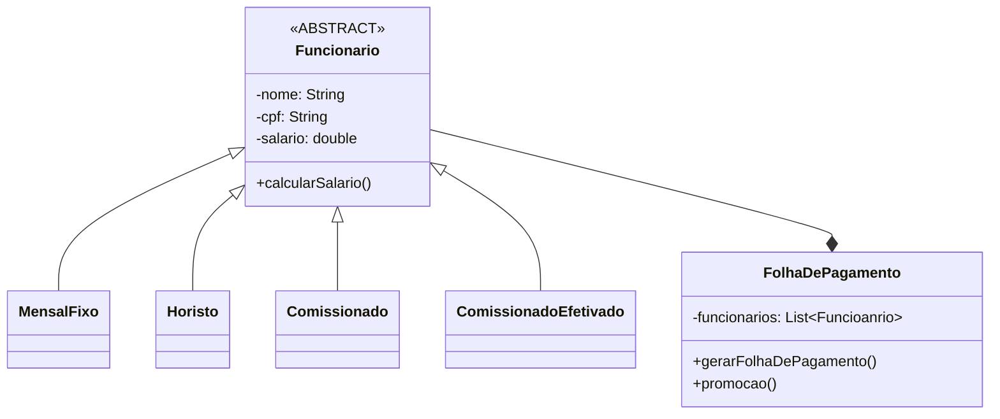

```mermaid
classDiagram 
    class Funcionario{
        <<ABSTRACT>>
        -nome: String
        -cpf: String
        -salario: double
        +calcularSalario()
    }
    
    class FolhaDePagamento{
       -funcionarios: List~Funcioanrio~
       +gerarFolhaDePagamento()
       +promocao()
    }
    class MensalFixo{
        
    }
    class Horisto{
        
    }
    class Comissionado{
        
    }
    class ComissionadoEfetivado{
        
    }
    Funcionario <|-- MensalFixo
    Funcionario <|-- Horisto
    Funcionario <|-- Comissionado
    Funcionario <|-- ComissionadoEfetivado
    Funcionario --* FolhaDePagamento


```