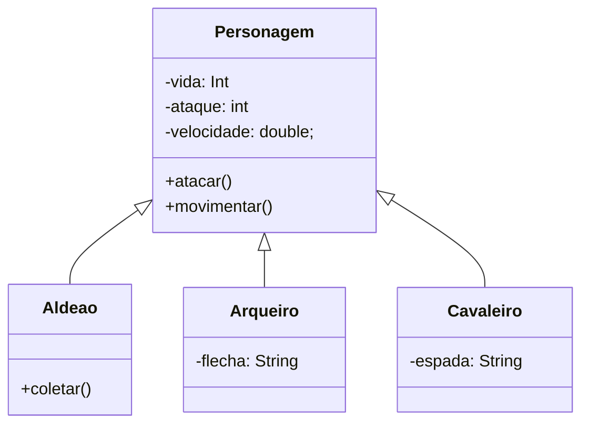
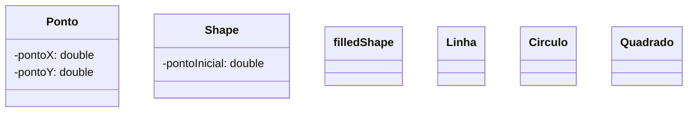

```mermaid
classDiagram
class Personagem{
    -vida: Int
    -ataque: int
    -velocidade: double;
    +atacar()
    +movimentar()
}
class Aldeao{
    +coletar()
}
class Arqueiro{
    -flecha: String
    
}
class Cavaleiro{
    -espada: String
}

Personagem <|-- Aldeao
Personagem <|-- Arqueiro
Personagem <|-- Cavaleiro
```

```mermaid
classDiagram
    
class Ponto{
    -pontoX: double
    -pontoY: double
 }
 class Shape{
     -pontoInicial: double
 }
 class filledShape{
     
 }
 class Linha{
     
 }
 class Circulo{
     
 }
 class Quadrado{
     
 }
 
```