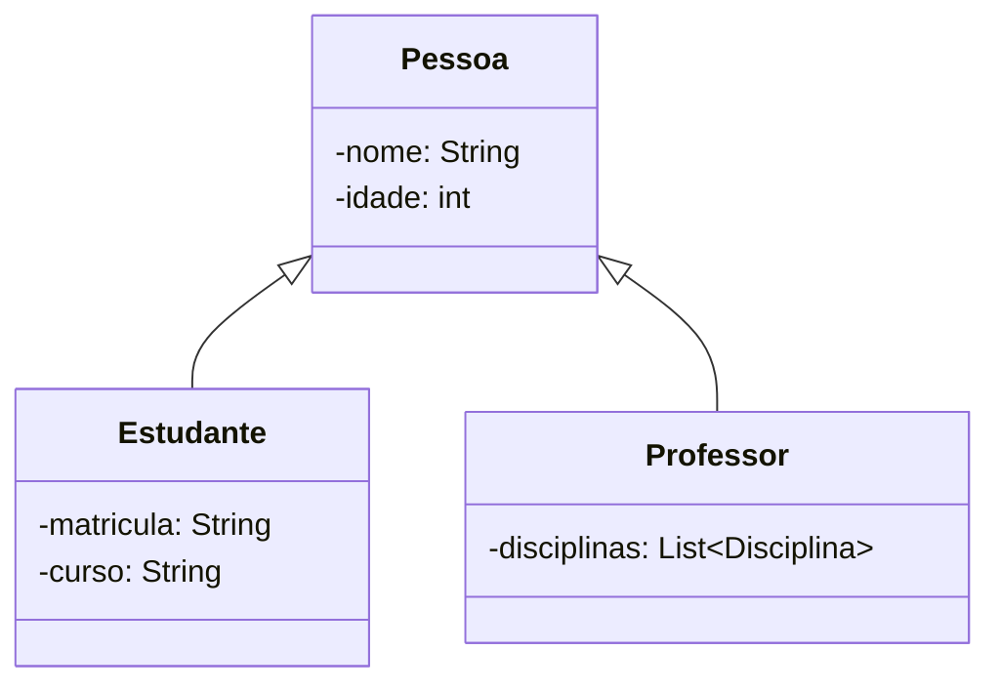
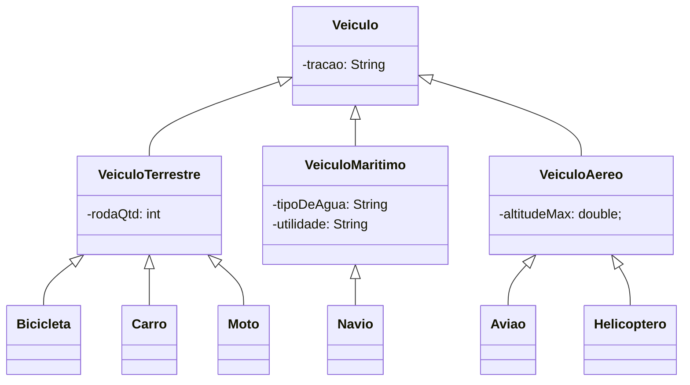
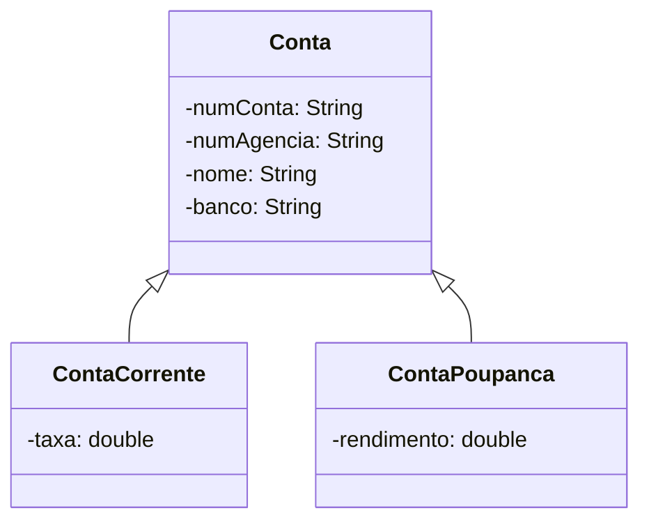

```mermaid
classDiagram
    class Pessoa{
        -nome: String
        -idade: int
        
    }
    class Estudante{
        -matricula: String
        -curso: String
    }
    class Professor{
        -disciplinas: List~Disciplina~
    }
    
    Pessoa <|-- Estudante
    Pessoa <|-- Professor

```

```mermaid
classDiagram
    class Veiculo{
        -tracao: String
        
    }
    class VeiculoTerrestre{
        -rodaQtd: int
    }
    class VeiculoMaritimo{
        -tipoDeAgua: String
        -utilidade: String
        
    }
    class VeiculoAereo{
        -altitudeMax: double;
    }
    class Bicicleta{
        
    }
    class Carro{
        
    }
    class Moto {
        
    }
    class Navio{
        
    }
    class Aviao{
      
        
    }
    class Helicoptero{
        
    }
    Veiculo <|-- VeiculoTerrestre
    Veiculo <|-- VeiculoMaritimo
    Veiculo <|-- VeiculoAereo
    VeiculoTerrestre <|-- Bicicleta
    VeiculoTerrestre <|-- Carro
    VeiculoTerrestre <|-- Moto
    VeiculoAereo <|-- Aviao
    VeiculoAereo <|-- Helicoptero
    VeiculoMaritimo <|-- Navio
    
    
```

```mermaid
classDiagram 
    class Conta{
        -numConta: String
        -numAgencia: String
        -nome: String
        -banco: String
    }
    class ContaCorrente{
        -taxa: double
        
    }
    class ContaPoupanca{
        -rendimento: double
        
    }
    
    Conta <|-- ContaCorrente
    Conta <|-- ContaPoupanca
```